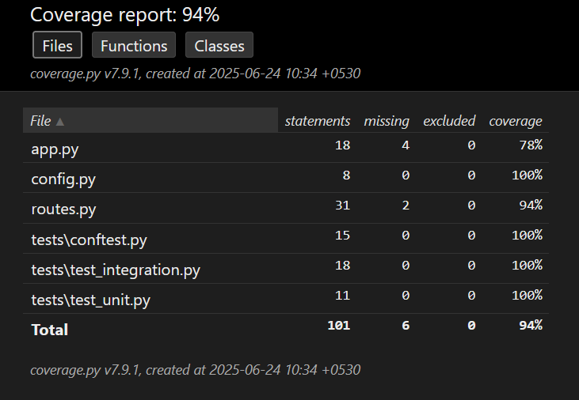
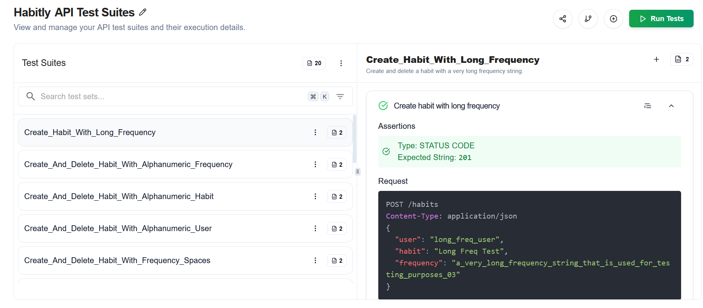

# 🧠 Habit Tracker API  

A simple Habit Tracker API built using **Flask** and **MongoDB**, with a basic HTML + JS frontend to interact with it.  
This project was developed as part of the **Keploy GitHub Learning Program** to practice REST API design, full-stack integration, and automated testing.  

---

## 🌐 API Endpoints  

| Method | Endpoint                        | Description              |
|--------|---------------------------------|--------------------------|
| GET    | `/habits`                       | Get all habits           |
| GET    | `/habits/<user>`                | Get habits by user       |
| POST   | `/habits`                       | Add a new habit          |
| PUT    | `/habits/<user>/<habit>`        | Update an existing habit |
| DELETE | `/habits/<user>/<habit>`        | Delete a habit           |

---

## 📦 Tech Stack  

- **Backend:** Flask (Python)  
- **Database:** MongoDB (PyMongo)  
- **Frontend:** HTML + JavaScript  
- **Other Tools:** dotenv, Flask-CORS  

---

## 🛠️ How to Run  

### Prerequisites  

- Python 3.x  
- MongoDB (local or Atlas)  
- `pip`  

### Steps  

```bash
git clone https://github.com/your-username/habit-tracker.git
cd habit-tracker
```

Create a `.env` file:

```env
MONGO_URI=mongodb://localhost:27017
PORT=5000
```

Install dependencies:

```bash
pip install -r requirements.txt
```

Run the server:

```bash
python app.py
```

---

## 🧪 Testing  

### Tools  

- pytest  
- pytest-cov  
- unittest.mock / pytest-mock  

Run tests with coverage:

```bash
# Windows
set PYTHONPATH=. && pytest --cov=. --cov-report=term

# Linux / Mac
PYTHONPATH=. pytest --cov=. --cov-report=term
```

Generate HTML coverage report:

```bash
pytest --cov=. --cov-report=html
```

---

## 📊 Test Coverage  



---

## ✅ AI-Powered API Test Reports

Keploy automatically generated and ran tests for my Flask API using the OpenAPI schema and curl requests.



---

## ⚙️ CI/CD Integration (GitHub Actions)

Keploy testing was integrated into my CI/CD workflow using GitHub Actions.

🔗 [View CI/CD Workflow File](.github/workflows/keploy.yml)

---

## 📬 Author  

**Akash Kumar**  
B.Tech ECSE @ KIIT  
[GitHub](https://github.com/404AkashNotFound)
